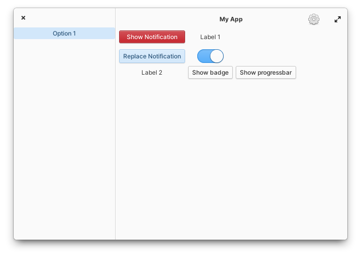

# gtk-hello

This is an example Vala and GTK+ 4 Application (includes i18n translations, save application state using GSettings, icons, metadata for appstore, and more).



## i18n Translations

To take in consideration, when you need to generate the pot template and translatable files. First you need to create manually each `.po` language file. Then run next commands:

To create pot template first time:
```bash
ninja com.github.libredeb.gtk-hello-pot
```

To generate the content on each `.po` language file:
```bash
ninja com.github.libredeb.gtk-hello-update-po
```

## Icons

After install this application, the icon cache need to be refreshed. To do that, run next command:
```bash
sudo update-icon-caches /usr/share/icons/*
```

## How to build this app?

To be able to build this app, you need follow this steps:

1. Install dependencies:
```bash
sudo apt install elementary-sdk
```

2. Configure build directory:
```bash
meson build --prefix=/usr
```

3. Compile and install the application:
```bash
cd build
ninja
ninja install
```

## Uninstall

To remove the application from your system, run next command from the root of the project:
```bash
sudo ninja -C build uninstall
```
